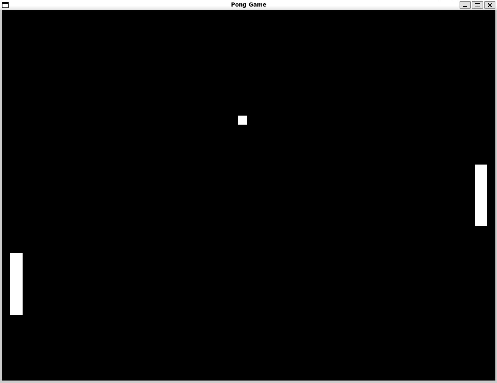

# Pong Game

A classic Pong implementation in C using SDL2 for graphics and input handling.

<div align="center">
  
</div>

## 📋 Overview
This project implements the classic Pong arcade game featuring two paddles and a bouncing ball. The game demonstrates fundamental game development concepts including:

- Real-time rendering with SDL2
- Physics simulation (collision detection)
- Input handling and game loop
- Structured C programming with modular design
- Frame rate control and smooth gameplay

## 🎮 Gameplay

- Player 1: Use W and S keys to move the left paddle up and down
- Player 2: Use ↑ and ↓ arrow keys to move the right paddle up and down
- Objective: Prevent the ball from reaching your side of the screen
- Ball Physics: Ball bounces off paddles and top/bottom walls
- Auto-Reset: Ball resets to center with random direction when it goes off-screen

## 🏗️ Architecture

The game is structured with clean, modular C code:  

pong.c  
├── Structs  
│   ├── Paddle - Contains rectangle and velocity data  
│   └── Ball - Contains rectangle and velocity data  
├── Game Logic  
│   ├── move_paddle() - Updates paddle positions  
│   ├── move_ball() - Updates ball position and wall collision  
│   ├── ball_paddle_collision() - Handles paddle collision detection  
│   └── reset_ball_position() - Resets ball with random direction  
└── Input/Rendering  
    ├── keyHandler() - Processes keyboard input  
    └── main() - Game loop with rendering  

## 🛠️ Technologies

- C - Core programming language
- SDL2 - Graphics, input, and window management
- GCC - Compiler

## ⚙️ Installation & Setup

**Prerequisites**  
First, install the SDL2 development library:  

Ubuntu/Debian:  

```bash
sudo apt update  
sudo apt install libsdl2-dev  
```

macOS (using Homebrew):
  
```bash
brew install sdl2
```

**Compilation**  
Compile the game using GCC:  

```bash
gcc pong.c -o pong -lSDL2
```

**Running the Game**  
Execute the compiled binary:  

```bash
./pong
```
